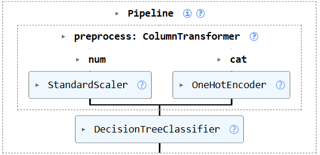
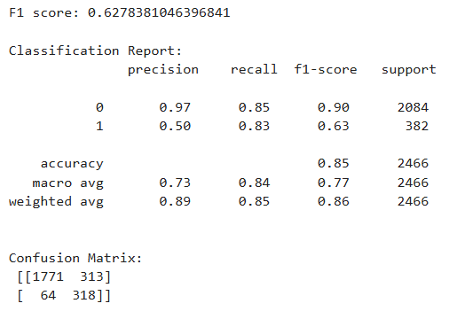
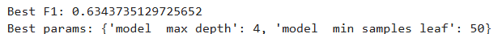

# 🛒 Shop Smart E-Commerce Revenue Prediction System

## 📌 Project Overview

The **Shop Smart E-Commerce Revenue Prediction System** is a Machine Learning-based classification project developed to predict whether an online shopping session will generate revenue for an e-commerce platform.

This project demonstrates an end-to-end Machine Learning workflow including:

* Data Preprocessing
* Feature Selection
* Train-Test Splitting
* Data Transformation
* Feature Scaling
* Categorical Encoding
* Pipeline Construction
* Model Training
* Model Evaluation
* Hyperparameter Tuning

The system analyzes customer session behavior, browsing patterns, and transaction-related features to identify potential revenue-generating sessions.

---

# 🎯 Objective

The objective of this project is to build an intelligent classification model that predicts customer purchase outcomes and helps e-commerce businesses optimize marketing strategies, improve customer targeting, and increase conversion rates.

---

# 🧠 Technologies Used

* Python
* Pandas
* NumPy
* Scikit-learn
* Jupyter Notebook

---

# 📂 Dataset Information

| Attribute       | Details                              |
| --------------- | ------------------------------------ |
| Dataset Name    | Shop Smart E-Commerce Dataset        |
| Type            | E-Commerce Customer Behavior Dataset |
| Problem Type    | Binary Classification                |
| Target Variable | Revenue                              |
| Framework       | Scikit-Learn Pipeline                |

---

# ⚙️ Machine Learning Workflow

## 1️⃣ Importing Libraries

Imported required libraries for:

* Data manipulation
* Machine Learning
* Feature preprocessing
* Model evaluation
* Hyperparameter optimization

---

## 2️⃣ Data Loading

Loaded the dataset using Pandas and separated:

* Features (`X`)
* Target Variable (`y`)

```python
X = df.drop(columns=["Revenue"])
y = df["Revenue"].astype(int)
```

---

## 3️⃣ Feature Identification

Automatically identified:

### Numerical Features

```python
num_features = X.select_dtypes(
    include=["int64","float64"]
).columns
```

### Categorical Features

```python
cat_features = X.select_dtypes(
    include=["object","category"]
).columns
```

---

## 4️⃣ Data Preprocessing

A preprocessing pipeline was created using `ColumnTransformer`.

### Numerical Features

Applied:

* StandardScaler

to normalize numerical data.

### Categorical Features

Applied:

* OneHotEncoder

to transform categorical variables into machine-readable format.

```python
OneHotEncoder(handle_unknown="ignore")
```

---

# 🔄 Machine Learning Pipeline

The project utilizes a complete Scikit-Learn Pipeline for streamlined preprocessing and model training.

## Pipeline Components

### Numerical Data

```text
Numerical Features
        ↓
StandardScaler
```

### Categorical Data

```text
Categorical Features
        ↓
OneHotEncoder
```

### Final Pipeline

```text
Input Features
      ↓
ColumnTransformer
      ↓
├── StandardScaler
├── OneHotEncoder
      ↓
DecisionTreeClassifier
      ↓
Revenue Prediction
```

---

# 📸 Pipeline Visualization

## ✔ Scikit-Learn Pipeline Structure



> Save the pipeline screenshot generated from the notebook inside:

```bash
images/pipeline_visualization.png
```

---

# 🤖 Machine Learning Model

## 🔹 Decision Tree Classifier

The model was configured with:

```python
DecisionTreeClassifier(
    max_depth=6,
    min_samples_leaf=30,
    class_weight="balanced",
    random_state=42
)
```

### Why These Parameters?

| Parameter               | Purpose                    |
| ----------------------- | -------------------------- |
| max_depth=6             | Reduces overfitting        |
| min_samples_leaf=30     | Smooth decision boundaries |
| class_weight="balanced" | Handles class imbalance    |
| random_state=42         | Ensures reproducibility    |

---

# 📊 Model Evaluation Results

## ✔ F1 Score

```text
0.6278
```

---

## ✔ Classification Report

| Class | Precision | Recall | F1-Score | Support |
| ----- | --------- | ------ | -------- | ------- |
| 0     | 0.97      | 0.85   | 0.90     | 2084    |
| 1     | 0.50      | 0.83   | 0.63     | 382     |

---

## ✔ Overall Performance

| Metric              | Score |
| ------------------- | ----- |
| Accuracy            | 0.85  |
| Macro Average F1    | 0.77  |
| Weighted Average F1 | 0.86  |

---

# 📈 Confusion Matrix

```python
[[1771  313]
 [  64  318]]
```

### Interpretation

* 1771 sessions correctly predicted as non-revenue
* 318 revenue sessions correctly identified
* 313 false positives
* 64 false negatives

---

# 🔥 Hyperparameter Tuning

Performed hyperparameter optimization using:

## GridSearchCV

```python
param_grid = {
    "model__max_depth":[4,6,8],
    "model__min_samples_leaf":[20,30,50]
}
```

### Cross Validation

```python
cv = 5
scoring = "f1"
```

---

## 🏆 Best Results

### Best F1 Score

```text
0.6348
```

### Best Parameters

```python
{
    'model__max_depth': 4,
    'model__min_samples_leaf': 50
}
```

---

# 📊 Performance Comparison

| Model Version         | F1 Score |
| --------------------- | -------- |
| Initial Decision Tree | 0.6278   |
| Tuned Decision Tree   | 0.6348   |

### Improvement

```text
+0.0070 F1 Score
```

The tuned model achieved better generalization while reducing overfitting.

---

# 📸 Project Screenshots

## ✔ Pipeline Visualization


---

## ✔ Classification Report



---

## ✔ Hyperparameter Tuning Results



---

# 📁 Project Structure

```bash
Shop-Smart-Ecommerce-Revenue-Prediction/
│
├── shop_smart_ecommerce.csv
├── revenue_prediction.ipynb
├── requirements.txt
├── README.md
│
├── images/
│   ├── pipeline_visualization.png
│   ├── classification_report.png
│   └── gridsearch_results.png
│
└── models/
    └── decision_tree_model.pkl
```

---

# 🚀 Future Improvements

* Random Forest Classifier
* XGBoost Integration
* LightGBM Model
* Feature Importance Analysis
* SHAP Explainability
* Customer Segmentation
* Real-Time Prediction Dashboard
* Model Deployment with Flask/FastAPI

---

# ⭐ Conclusion

This project demonstrates the practical application of Machine Learning in e-commerce analytics by predicting customer revenue outcomes using behavioral and session-level data.

The project successfully showcases:

* Data preprocessing using pipelines
* Automated feature transformation
* Decision Tree Classification
* Class imbalance handling
* Model evaluation using multiple metrics
* Hyperparameter optimization with GridSearchCV

The final tuned Decision Tree model achieved strong classification performance and provides a solid foundation for advanced e-commerce recommendation and revenue prediction systems.
